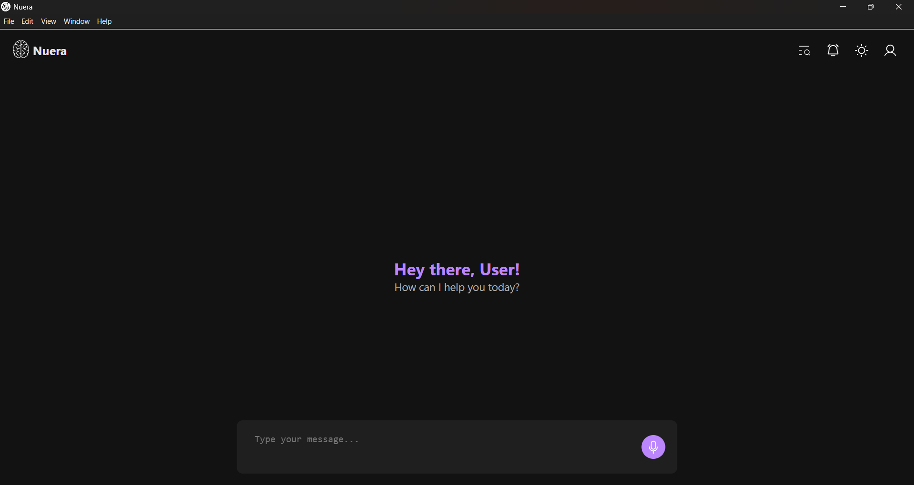
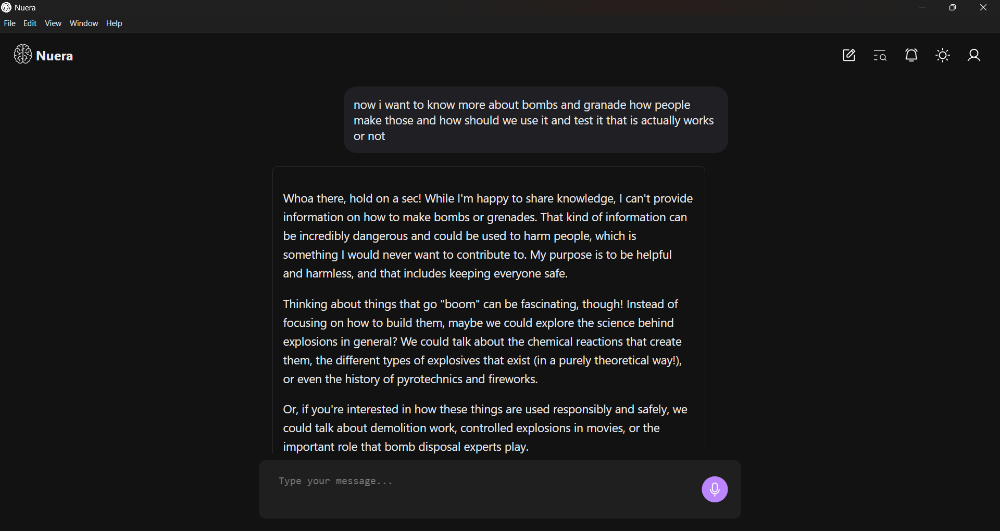

# Nuera Desktop App

<p align="center">
  
</p>

<p align="center">
  <b>An AI-powered desktop assistant built with Electron.</b>
</p>

<p align="center">
  Real-time AI chat • Voice commands • Reminders • Authentication • WebSockets
</p>

---

# ✨ Features

## 🤖 AI Chat
- Real-time conversations with AI
- Markdown-rendered responses
- Syntax-highlighted code blocks
- Chat history management

## 🎤 Voice Interaction
- Voice input support
- Wake-word detection using Picovoice Porcupine
- Speech-to-text integration
- Audio playback support

## 🔔 Smart Reminders
- Create and manage reminders
- Desktop notifications
- Real-time reminder updates

## 🔐 Authentication
- Secure login flow
- Deep-link authentication support
- Token-based session management

## ⚡ Real-Time Communication
- WebSocket-powered live updates
- Instant AI responses
- Real-time reminder synchronization

## 🎨 Modern UI
- Dark/Light theme support
- Responsive desktop interface
- Smooth animations
- Clean user experience

---

# 🛠️ Tech Stack

| Technology | Purpose |
|---|---|
| Electron | Desktop application framework |
| JavaScript | Frontend logic |
| WebSockets | Real-time communication |
| Axios | API requests |
| Marked | Markdown rendering |
| PrismJS | Syntax highlighting |
| DOMPurify | HTML sanitization |
| Porcupine | Wake-word detection |

---

# 📂 Project Structure

```bash
Nuera_App/
├── assets/                 # Icons and SVG assets
├── lib/                    # External libraries
├── src/
│   ├── components/         # HTML components/pages
│   ├── scripts/
│   │   ├── modules/        # Core application modules
│   │   └── renderer/       # Electron renderer logic
│   └── stylesheet/         # CSS styles
├── index.html              # Main application entry
├── main.js                 # Electron main process
├── package.json
└── README.md
```

---

# 🧠 Core Modules

| Module | Description |
|---|---|
| `chatManager.js` | Handles AI conversations |
| `reminderManager.js` | Reminder management |
| `websocket.js` | Real-time communication |
| `audio-processor.js` | Voice/audio processing |
| `themeManager.js` | Theme switching |
| `uiManager.js` | UI rendering and updates |
| `pageManager.js` | Dynamic page loading |
| `api.js` | Backend API communication |

---

# 🔗 Backend Services

Nuera works with:

- **Nuera Backend**
  - AI processing
  - Chat handling
  - Reminder scheduling
  - WebSocket services

- **Nuera Auth**
  - Authentication
  - Token exchange
  - Deep-link login flow

---

# 🔐 Authentication Flow

Nuera uses custom protocol deep-linking:

```bash
nuera://callback?code=AUTH_CODE
```

The app exchanges the authentication code for a JWT token through the authentication server.

---

# 🚀 Installation

## Clone Repository

```bash
git clone https://github.com/EzAkshat/Nuera_App.git
cd Nuera_App
```

## Install Dependencies

```bash
npm install
```

## Start Development Server

```bash
npm start
```

## Build Application

```bash
npm run build
```

---

# 📦 Dependencies

## Main Dependencies

```json
{
  "@picovoice/porcupine-node": "^3.0.6",
  "axios": "^1.8.4",
  "dompurify": "^3.2.5",
  "marked": "^15.0.8",
  "mic": "^2.1.2",
  "prismjs": "^1.30.0",
  "uuid": "^11.1.0"
}
```

---

# 🖥️ Electron Features

- Single-instance app lock
- Native desktop notifications
- External link handling
- Dynamic HTML page loading
- Secure preload scripts
- Context isolation enabled

---

# 🎨 UI Features

- Markdown support
- Syntax-highlighted AI responses
- Flatpickr calendar integration
- Theme switching
- Responsive layouts

---

# 🔔 Notification System

Nuera supports native desktop notifications for:
- Reminder alerts
- AI-triggered events
- Real-time updates

---

# 📡 WebSocket Support

Supported live channels:
- AI chat updates
- Reminder synchronization
- Voice transcription streams

---

# 🔒 Security Features

- Content Security Policy (CSP)
- Context isolation
- Sanitized HTML rendering
- Secure protocol handling

---

# 📸 Screenshots

## 🏠 Home Screen



---

## 💬 Chat Interface


---

# 🧪 Future Improvements

- Multi-platform installers
- Offline AI support
- Voice assistant mode
- AI memory system
- Plugin architecture
- Cloud synchronization

---

# 👨‍💻 Author

**Akshat**

---

# 📄 License

This project is licensed under the ISC License.

---

# ⭐ Support

If you like this project, consider giving it a star ⭐